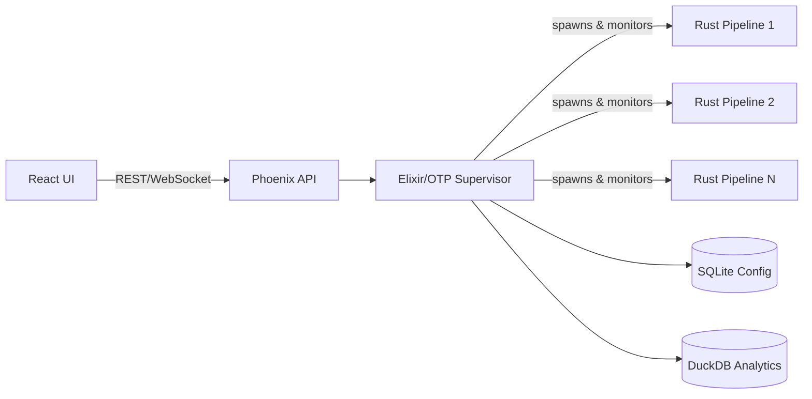

<br />
<p align="center">
  
</p>

<h1 align="center">HydraSRT</h1>

<p align="center">
  An open-source alternative to Haivision SRT Gateway.
  <br />
  <a href="https://github.com/abc3/hydra-srt/issues/new">Report Bug</a>
  ·
  <a href="https://github.com/abc3/hydra-srt/issues/new?labels=enhancement">Request Feature</a>
</p>

## Status

> **Project Status**: Beta. APIs and behavior may change.

[](https://github.com/abc3/hydra-srt/blob/main/LICENSE)

### Supported transports

| Transport | Input | Output |
| --------- | ----- | ------ |
| SRT       | ✔     | ✔      |
| UDP       | ✔     | ✔      |
| RTP (TS)  | ✔     | —      |

### Planned transports

| Transport | Input | Output |
| --------- | ----- | ------ |
| RTMP      | —     | —      |
| HLS       | —     | —      |
| WebRTC    | —     | —      |
| MoQ       | —     | —      |

### Capabilities

| Capability | Notes | Status |
| ---------- | ----- | ------ |
| One-to-many distribution | Single source to multiple unicast/multicast outputs | Beta |
| Reliability | Source failover and reconnection | Beta |
| Security | SRT passphrase and stream ID | Beta |
| Observability | Prometheus metrics, route stats, and pipeline logs | Beta |

Missing a feature? [Open an issue](https://github.com/abc3/hydra-srt/issues/new?labels=enhancement).

## Overview

https://github.com/user-attachments/assets/8230f902-b037-424f-a337-a3828dac6a3c

HydraSRT is an open-source alternative to Haivision SRT Gateway for reliable video transport and routing. It manages SRT, UDP, and RTP (TS over RTP) streams with built-in failover, supervision, metrics, and a modern web UI and API designed for broadcast and live production workflows.

Built with Elixir(Erlang/OTP), Rust, and GStreamer, HydraSRT combines strong fault isolation with lightweight orchestration. The BEAM supervises routing and control logic, while isolated media pipelines run only where active streams are present, providing high reliability with low system overhead.

## Architecture

HydraSRT has three layers:



**Management & Control (Elixir/OTP)**
- Supervises routes and restarts failed route processes
- Stores configuration and route state in SQLite
- Exposes REST and WebSocket APIs
- Handles failover and source switching

**Streaming & Processing (Rust + GStreamer)**
- Runs each route as an isolated OS process
- Uses GStreamer for media processing
- Keeps pipeline crashes limited to the affected route

**User Interface (React + Vite)**
- Route management dashboard
- Real-time status over WebSocket
- Historical metrics and logs

See [docs/architecture.md](docs/architecture.md) for details.

## Quick Start

### Docker (Recommended)

```bash
docker run --rm -p 4000:4000 \
  -p 4100-4500:4100-4500/udp \
  -v "$(pwd)/data/db:/app/db" \
  -e PHX_SERVER=true \
  -e DATABASE_PATH=/app/db/hydra_srt.db \
  -e ANALYTICS_DATABASE_PATH=/app/db/hydra_srt_analytics.duckdb \
  -e API_AUTH_USERNAME=admin \
  -e API_AUTH_PASSWORD=password123 \
  streamband/hydra-srt:latest
```

Open [http://127.0.0.1:4000](http://127.0.0.1:4000) and log in with `admin` / `password123`.

### Local Development

```bash
# First-time setup
mix setup

# Start dev server (Elixir + Vite)
make dev
```

Web UI: [http://localhost:5173](http://localhost:5173).

Setup, deployment, and troubleshooting: [docs/development.md](docs/development.md).

## Features

- SRT source and destination modes: Listener, Caller, Rendezvous
- UDP sources and destinations
- RTP (TS over RTP) sources
- SRT authentication with passphrase and stream ID support
- Source failover with primary + backup sources, automatic failover, and manual source switching
- System metrics via Prometheus `/metrics`
- Historical analytics and pipeline logs stored in DuckDB
- Real-time route status updates over WebSocket

## Documentation

| Document                              | Purpose                               |
| ------------------------------------- | ------------------------------------- |
| [docs/development.md](docs/development.md) | Setup, deployment, and Docker guide |
| [docs/architecture.md](docs/architecture.md) | System design and technical details |
| [docs/api.md](docs/api.md)            | REST API documentation                |
| [docs/mcp.md](docs/mcp.md)            | MCP server, tokens, and client setup |
| [docs/envs.md](docs/envs.md)          | Environment variables reference       |

## Contributing

See [CONTRIBUTING.md](CONTRIBUTING.md) for contribution guidelines.

## License

Apache 2.0. See [LICENSE](LICENSE).

## Inspiration

- [Secure Reliable Transport](https://en.wikipedia.org/wiki/Secure_Reliable_Transport)
- [Haivision SRT Gateway](https://www.haivision.com/products/srt-gateway/)

## Contact

Use GitHub issues: [https://github.com/abc3/hydra-srt/issues](https://github.com/abc3/hydra-srt/issues)
