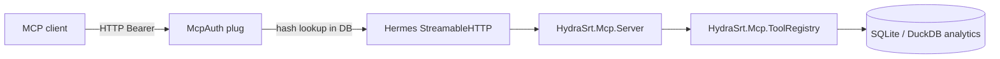

# MCP in HydraSRT

HydraSRT exposes a [Model Context Protocol (MCP)](https://modelcontextprotocol.io/) server for external clients (Cursor, Claude Desktop, and similar tools). Through MCP, an assistant can manage routes, inspect logs and node stats, and perform other curated operations without copying data from the UI.

This document describes what is implemented in the project as of the current version.

---

## What works today

| Component | Description |
|-----------|-------------|
| MCP server | `HydraSrt.Mcp.Server` built on [`hermes_mcp`](https://hex.pm/packages/hermes_mcp) |
| Transport | Streamable HTTP at the **`/mcp`** endpoint |
| Authentication | Bearer tokens from the `tokens` table (separate from the UI session) |
| Token management | REST API `/api/tokens` + **Settings → MCP tokens** tab (`/settings/tokens`) |
| Tools | **43 curated tools** (routes, sources, destinations, tags, interfaces, nodes, observability) |

---

## Architecture



1. **Phoenix** accepts requests at `/mcp`.
2. **`HydraSrtWeb.Plugs.McpAuth`** validates the `Authorization: Bearer <token>` header.
3. **`Hermes.Server.Transport.StreamableHTTP.Plug`** handles the MCP protocol (JSON-RPC, SSE).
4. **`HydraSrt.Mcp.Server`** delegates to **`HydraSrt.Mcp.ToolRegistry`**, which dispatches to domain modules (`Db`, `HydraSrt`, `Analytics`, `SystemInterfaces`, `NodeStats`) without HTTP self-calls.

The MCP server starts with the application (`HydraSrt.Application`), alongside `Hermes.Server.Registry`.

---

## `/mcp` endpoint

- **URL:** `http://<host>:<port>/mcp` (default: `http://localhost:4000/mcp`)
- **Methods:** GET (SSE), POST (JSON-RPC), DELETE (session close) — per MCP Streamable HTTP
- **Without a token:** **`401 Unauthorized`** and the `WWW-Authenticate: Bearer` header

MCP does **not** use the session token from `POST /api/login`. `/mcp` requires a dedicated MCP token.

---

## Access tokens

### Purpose

Tokens are long-lived API keys for MCP clients. You can create several (for example, one for Cursor and one for another agent) and revoke them independently.

### Storage

**`tokens`** table (SQLite):

| Column | Description |
|--------|-------------|
| `id` | UUID (binary_id) |
| `name` | Human-readable name (unique) |
| `hash` | SHA-256 hash of the secret (not plaintext) |
| `inserted_at`, `updated_at` | Created / updated timestamps |

On create, a random secret is generated (30 bytes, URL-safe Base64). Only the hash is stored in the database; the **full value is shown once** in the UI after creation.

### Managing via the UI

1. Sign in to the web UI (normal login).
2. **Settings → MCP tokens** (`/settings/tokens`).
3. **Add token** — enter a name and save.
4. In the **Copy your MCP token** modal — copy the secret (**Copy token** button).
5. If the secret is lost — **Delete** the old token and create a new one (the value cannot be recovered).

You can rename a token (**Edit**); you cannot change the secret of an existing token.

### Managing via the REST API

Requires **session** authentication from the UI (`Authorization: Bearer <session_token>` from `/api/login`).

| Method | Path | Action |
|--------|------|--------|
| `GET` | `/api/tokens` | List tokens (no secrets) |
| `POST` | `/api/tokens` | Create; secret only in the response |
| `PUT` | `/api/tokens/:id` | Rename |
| `DELETE` | `/api/tokens/:id` | Revoke |

Payload details and response examples are in [docs/api.md](api.md) (**MCP Tokens** and **MCP Endpoint** sections).

---

## MCP client setup

### Cursor (example)

In MCP configuration (`mcp.json` or Cursor settings):

```json
{
  "mcpServers": {
    "hydrasrt": {
      "url": "http://localhost:4000/mcp",
      "headers": {
        "Authorization": "Bearer YOUR_MCP_TOKEN"
      }
    }
  }
}
```

Replace:

- `http://localhost:4000` — with your HydraSRT URL (host and port from `PORT` / reverse proxy).
- `YOUR_MCP_TOKEN` — the secret copied when creating the token in Settings.

After changes, restart the MCP client or reconnect the server.

### Google Antigravity

Antigravity uses **`serverUrl`**, not `url` (Cursor-style configs will fail with a JSON-RPC decode error on `tools/list` because the Bearer token is never sent).

Shared config file: `~/.gemini/config/mcp_config.json` (or `~/.gemini/antigravity/mcp_config.json` on some installs).

```json
{
  "mcpServers": {
    "hydrasrt": {
      "type": "streamable-http",
      "serverUrl": "http://localhost:4000/mcp",
      "headers": {
        "Authorization": "Bearer YOUR_MCP_TOKEN"
      }
    }
  }
}
```

Do **not** use `"url"` or Cursor-style `"transport": "streamable_http"` — Antigravity expects `serverUrl` and optionally `"type": "streamable-http"`.

If the server still shows a red error but lists tools, that is a [known Antigravity quirk](https://github.com/github/github-mcp-server/blob/main/docs/installation-guides/install-antigravity.md) — try calling a tool anyway. If `tools/list` keeps failing, use the **`mcp-remote` stdio bridge** (proven workaround for HTTP MCP servers in Antigravity):

```json
{
  "mcpServers": {
    "hydrasrt": {
      "command": "npx",
      "args": [
        "-y",
        "mcp-remote",
        "http://localhost:4000/mcp",
        "--header",
        "Authorization:${HYDRA_MCP_AUTH}",
        "--allow-http",
        "--transport",
        "http-only"
      ],
      "env": {
        "HYDRA_MCP_AUTH": "Bearer YOUR_MCP_TOKEN"
      }
    }
  }
}
```

After editing, open **Settings → Customizations → Installed MCP Servers → Refresh**, or restart Antigravity.

### Verification

- Without an `Authorization` header — `401`.
- With an invalid token — `401`.
- With a valid MCP token — the client completes MCP initialization and sees **43 tools** (see catalog below).
- A UI session token does **not** work for `/mcp`.

---

## Response contract

MCP tools return structured JSON via Hermes:

- **Success:** `{"data": ...}` in most cases. List endpoints may also include `"meta"` (pagination).
- **Errors:** `{"error": "message"}` or `{"errors": {...}}` for validation failures.
- **Node tools:** REST returns raw JSON for nodes; MCP normalizes into `{"data": ...}` for consistency.
- **Unknown tool:** structured error `{"error": "Unknown tool: <name>"}` with `isError: true`.

Payload field shapes match [docs/api.md](api.md) where applicable.

---

## Tool contracts

### Scoped endpoints

All **source** and **destination** tools require **`route_id`** in addition to entity IDs. MCP uses `destination_id` (REST paths use `dest_id`).

### Time ranges (analytics / logs)

Supported `window` values: `last_30_min`, `last_hour`, `last_6_hour`, `last_24_hour`, or custom **`from` + `to`** (ISO8601).

**`window: live` is not supported.** The UI converts “live” to rolling `from`/`to` client-side. MCP clients must send explicit `from` and `to` for polling (for example, the last 5 minutes).

### Nodes

- **`get_self_node`** — local node only; no `node_id` parameter.
- **`get_node_analytics`** — `node_id` must match the `host` field from `list_nodes` / `get_self_node`.

### Probes

**`test_route_source`** and **`test_source`** run an active ffprobe network probe. MCP tools use a shorter timeout (~3.5s via `mcp_probe_timeout_ms`); REST probes may block up to **15 seconds**.

### Out of scope

MCP token CRUD, backup/restore, WebSocket live push, signal generation, pipeline kill, and UI login remain REST/UI only. See [docs/api.md](api.md) for those endpoints.

---

## Available tools (43)

Implementation reads from `HydraSrt.Db` and related modules directly (no internal HTTP calls).

### Routes (10)

| Tool | Description |
|------|-------------|
| `list_routes` | List routes (`page`, `limit`, `sort_by` optional) |
| `get_route` | Route by `route_id` (includes sources and destinations) |
| `create_route` | Create route (`route` object) |
| `update_route` | Update route (`route_id`, `route`) |
| `delete_route` | Delete route (`route_id`) |
| `start_route` | Start pipeline (`route_id`) |
| `stop_route` | Stop pipeline (`route_id`) |
| `restart_route` | Restart pipeline (`route_id`) |
| `switch_route_source` | Switch active source (`route_id`, `source_id`) |
| `test_route_source` | Probe route source config (`route` object; MCP ~3.5s, REST up to 15s) |

### Sources (7) — require `route_id`

| Tool | Description |
|------|-------------|
| `list_sources` | List sources for a route |
| `get_source` | Get source (`source_id`) |
| `create_source` | Create source (`source` object) |
| `update_source` | Update source (`source_id`, `source`) |
| `delete_source` | Delete source (`source_id`) |
| `reorder_sources` | Reorder sources (`source_ids` array) |
| `test_source` | Probe saved source (`source_id`; MCP ~3.5s, REST up to 15s) |

### Destinations (5) — require `route_id`

| Tool | Description |
|------|-------------|
| `list_destinations` | List destinations for a route |
| `get_destination` | Get destination (`destination_id`) |
| `create_destination` | Create destination (`destination` object) |
| `update_destination` | Update destination (`destination_id`, `destination`) |
| `delete_destination` | Delete destination (`destination_id`) |

### Tags (4)

| Tool | Description |
|------|-------------|
| `list_tags` | List route tags |
| `create_tag` | Create tag (`tag` object with `name`) |
| `update_tag` | Update tag (`tag_id`, `tag`) |
| `delete_tag` | Delete tag (`tag_id`) |

### Interfaces (8)

| Tool | Description |
|------|-------------|
| `list_interfaces` | Configured interface aliases (SQLite) |
| `get_interface` | Get configured interface (`interface_id`) |
| `create_interface` | Create alias (`interface` object) |
| `update_interface` | Update alias (`interface_id`, `interface`) |
| `delete_interface` | Delete alias (`interface_id`) |
| `list_system_interfaces` | OS interfaces from ifconfig (`sys_name`, `ip`, …) |
| `get_system_interface` | One OS interface by `sys_name` |
| `get_system_interfaces_raw` | Raw ifconfig text |

The `ip` field is `"-"` when no address was parsed. IPv6-only interfaces may show an IPv6 value per the parser.

### Nodes (3)

| Tool | Description |
|------|-------------|
| `list_nodes` | Cluster nodes with CPU/RAM/network (local node today) |
| `get_self_node` | Local node snapshot (no parameters) |
| `get_node_analytics` | Node metrics time-series (`node_id`, time range) |

### Observability (6)

| Tool | Description |
|------|-------------|
| `get_route_events` | Route event log (`route_id`, time range, filters) |
| `get_route_pipeline_logs` | GStreamer pipeline logs (`route_id`, time range) |
| `get_route_pipeline_log_distinct` | Distinct log values (`route_id`, `column`: `level` or `category`) |
| `get_routes_status_history` | Route status change history (optional `route_id`, `status`) |
| `get_route_analytics` | Route metrics time-series (`route_id`, time range) |
| `get_routes_status_analytics` | Fleet status time-series (time range) |

WebSocket live stats from the UI are **not** replicated over MCP; poll analytics/log tools instead.

---

## Security

| Topic | Behavior |
|-------|----------|
| Secret in DB | SHA-256 hash stored, not plaintext |
| Secret display | Only once on `POST /api/tokens` / UI create |
| UI session vs MCP | Different tables / checks; not interchangeable |
| Revocation | `DELETE /api/tokens/:id` — immediate |
| Empty token list | `/mcp` unavailable to everyone (all requests `401`) |
| Token scope | A valid MCP token grants the same operational power as the REST API for curated tools: route/source/destination CRUD, start/stop/restart, **ffprobe network probes** (may reach internal hosts; MCP ~3.5s, REST up to ~15s), raw ifconfig, and analytics reads. Treat leaked tokens like leaked admin API keys — revoke immediately and issue narrowly scoped tokens per client. |
| Hermes | Authentication is our Plug before forward; Hermes only passes `conn.assigns` into the frame |

Secrets in SQLite are not encrypted with Cloak (as in Supavisor): a one-way hash is enough for MCP tokens because plaintext is needed only once by the client.

---

## Repository files

| Path | Purpose |
|------|---------|
| `lib/hydra_srt/mcp/server.ex` | Hermes MCP server entrypoint |
| `lib/hydra_srt/mcp/tool_registry.ex` | Tool registration and dispatch |
| `lib/hydra_srt/mcp/input_schema.ex` | JSON Schema to Hermes input schema conversion |
| `lib/hydra_srt/mcp/helpers.ex` | Response envelopes and error mapping |
| `lib/hydra_srt/mcp/tools/*.ex` | Tool handlers by domain |
| `lib/hydra_srt/route_control.ex` | Shared route switch/update logic |
| `lib/hydra_srt_web/plugs/mcp_auth.ex` | Bearer check for `/mcp` |
| `lib/hydra_srt_web/controllers/token_controller.ex` | REST CRUD for tokens |
| `lib/hydra_srt/db.ex` | `create_token`, `authenticate_mcp_token`, … |
| `lib/hydra_srt/api/token.ex` | Ecto schema for `tokens` |
| `lib/hydra_srt_web/router.ex` | `/mcp`, `/api/tokens` |
| `web_app/src/pages/settings/McpTokensTab.tsx` | MCP tokens tab UI |
| `web_app/src/utils/tokensApi.ts` | Typed API client |
| `priv/repo/migrations/20260523120000_create_tokens.exs` | Table migration |

---

## Database migration

On a new or updated instance:

```bash
mix ecto.migrate
```

Creates the `tokens` table with indexes on `name` and `hash`.

---

## Current limitations

- Curated toolset only — not every REST endpoint has an MCP equivalent (see **Out of scope** above).
- No MCP resources or prompts yet (tools only).
- No token expiry (`expires_at`) or `last_used_at` — tokens remain valid until deleted.
- No Playwright E2E tests for `/settings/tokens` yet; MCP tools and auth are covered by unit tests and opt-in HTTP E2E tests under `test/e2e_mcp/` (`E2E_MCP=true mix test --only e2e_mcp`).

---

## Related documentation

- [docs/api.md](api.md) — REST API, including `/api/tokens` and MCP header examples
- [docs/development.md](development.md) — local run (`make dev`)
- [docs/envs.md](envs.md) — environment variables (port, UI auth)
