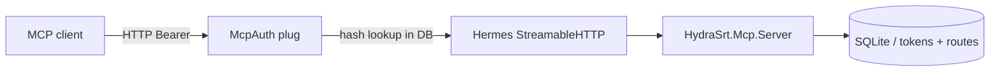

# MCP in HydraSRT

HydraSRT exposes a [Model Context Protocol (MCP)](https://modelcontextprotocol.io/) server for external clients (Cursor, Claude Desktop, and similar tools). Through MCP, an assistant can read route data without manually copying it from the UI.

This document describes what is implemented in the project as of the current version.

---

## What works today

| Component | Description |
|-----------|-------------|
| MCP server | `HydraSrt.Mcp.Server` built on [`hermes_mcp`](https://hex.pm/packages/hermes_mcp) |
| Transport | Streamable HTTP at the **`/mcp`** endpoint |
| Authentication | Bearer tokens from the `tokens` table (separate from the UI session) |
| Token management | REST API `/api/tokens` + **Settings → MCP tokens** tab (`/settings/tokens`) |
| Tools | One tool: `list_routes` |

---

## Architecture



1. **Phoenix** accepts requests at `/mcp`.
2. **`HydraSrtWeb.Plugs.McpAuth`** validates the `Authorization: Bearer <token>` header.
3. **`Hermes.Server.Transport.StreamableHTTP.Plug`** handles the MCP protocol (JSON-RPC, SSE).
4. **`HydraSrt.Mcp.Server`** registers tools and serves tool calls.

The MCP server starts with the application (`HydraSrt.Application`), alongside `Hermes.Server.Registry`.

---

## `/mcp` endpoint

- **URL:** `http://<host>:<port>/mcp` (default: `http://localhost:4000/mcp`)
- **Methods:** GET (SSE), POST (JSON-RPC), DELETE (session close) — per MCP Streamable HTTP
- **Without a token:** **`401 Unauthorized`** and the `WWW-Authenticate: Bearer` header

MCP does **not** use the session token from `POST /api/login`. `/mcp` requires a dedicated MCP token.

---

## Access tokens

### Purpose

Tokens are long-lived API keys for MCP clients. You can create several (for example, one for Cursor and one for another agent) and revoke them independently.

### Storage

**`tokens`** table (SQLite):

| Column | Description |
|--------|-------------|
| `id` | UUID (binary_id) |
| `name` | Human-readable name (unique) |
| `hash` | SHA-256 hash of the secret (not plaintext) |
| `inserted_at`, `updated_at` | Created / updated timestamps |

On create, a random secret is generated (30 bytes, URL-safe Base64). Only the hash is stored in the database; the **full value is shown once** in the UI after creation.

### Managing via the UI

1. Sign in to the web UI (normal login).
2. **Settings → MCP tokens** (`/settings/tokens`).
3. **Add token** — enter a name and save.
4. In the **Copy your MCP token** modal — copy the secret (**Copy token** button).
5. If the secret is lost — **Delete** the old token and create a new one (the value cannot be recovered).

You can rename a token (**Edit**); you cannot change the secret of an existing token.

### Managing via the REST API

Requires **session** authentication from the UI (`Authorization: Bearer <session_token>` from `/api/login`).

| Method | Path | Action |
|--------|------|--------|
| `GET` | `/api/tokens` | List tokens (no secrets) |
| `POST` | `/api/tokens` | Create; secret only in the response |
| `PUT` | `/api/tokens/:id` | Rename |
| `DELETE` | `/api/tokens/:id` | Revoke |

Payload details and response examples are in [docs/api.md](api.md) (**MCP Tokens** and **MCP Endpoint** sections).

---

## MCP client setup

### Cursor (example)

In MCP configuration (`mcp.json` or Cursor settings):

```json
{
  "mcpServers": {
    "hydrasrt": {
      "url": "http://localhost:4000/mcp",
      "headers": {
        "Authorization": "Bearer YOUR_MCP_TOKEN"
      }
    }
  }
}
```

Replace:

- `http://localhost:4000` — with your HydraSRT URL (host and port from `PORT` / reverse proxy).
- `YOUR_MCP_TOKEN` — the secret copied when creating the token in Settings.

After changes, restart the MCP client or reconnect the server.

### Verification

- Without an `Authorization` header — `401`.
- With an invalid token — `401`.
- With a valid MCP token — the client completes MCP initialization and sees the `list_routes` tool.
- A UI session token does **not** work for `/mcp`.

---

## Available tools

### `list_routes`

- **Description:** returns the route list (same data as `GET /api/routes`, including destinations).
- **Parameters:** none (`input_schema: {}`).
- **Response:** JSON with `data` (array of routes) and `meta` (`page`, `limit`, `total`).

The implementation reads from `HydraSrt.Db` directly, without a separate HTTP call to the REST API.

---

## Security

| Topic | Behavior |
|-------|----------|
| Secret in DB | SHA-256 hash stored, not plaintext |
| Secret display | Only once on `POST /api/tokens` / UI create |
| UI session vs MCP | Different tables / checks; not interchangeable |
| Revocation | `DELETE /api/tokens/:id` — immediate |
| Empty token list | `/mcp` unavailable to everyone (all requests `401`) |
| Hermes | Authentication is our Plug before forward; Hermes only passes `conn.assigns` into the frame |

Secrets in SQLite are not encrypted with Cloak (as in Supavisor): a one-way hash is enough for MCP tokens because plaintext is needed only once by the client.

---

## Repository files

| Path | Purpose |
|------|---------|
| `lib/hydra_srt/mcp/server.ex` | MCP server, `list_routes` tool |
| `lib/hydra_srt_web/plugs/mcp_auth.ex` | Bearer check for `/mcp` |
| `lib/hydra_srt_web/controllers/token_controller.ex` | REST CRUD for tokens |
| `lib/hydra_srt/db.ex` | `create_token`, `authenticate_mcp_token`, … |
| `lib/hydra_srt/api/token.ex` | Ecto schema for `tokens` |
| `lib/hydra_srt_web/router.ex` | `/mcp`, `/api/tokens` |
| `web_app/src/pages/settings/McpTokensTab.tsx` | MCP tokens tab UI |
| `web_app/src/utils/tokensApi.ts` | Typed API client |
| `priv/repo/migrations/20260523120000_create_tokens.exs` | Table migration |

---

## Database migration

On a new or updated instance:

```bash
mix ecto.migrate
```

Creates the `tokens` table with indexes on `name` and `hash`.

---

## Current limitations

- One tool — `list_routes`; no other MCP primitives (resources, prompts) yet.
- No token expiry (`expires_at`) or `last_used_at` — tokens remain valid until deleted.
- No Playwright E2E tests for `/settings/tokens` yet; the backend is covered by unit tests.

---

## Related documentation

- [docs/api.md](api.md) — REST API, including `/api/tokens` and MCP header examples
- [docs/development.md](development.md) — local run (`make dev`)
- [docs/envs.md](envs.md) — environment variables (port, UI auth)
